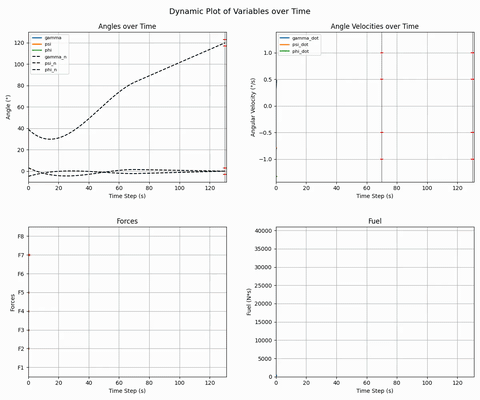
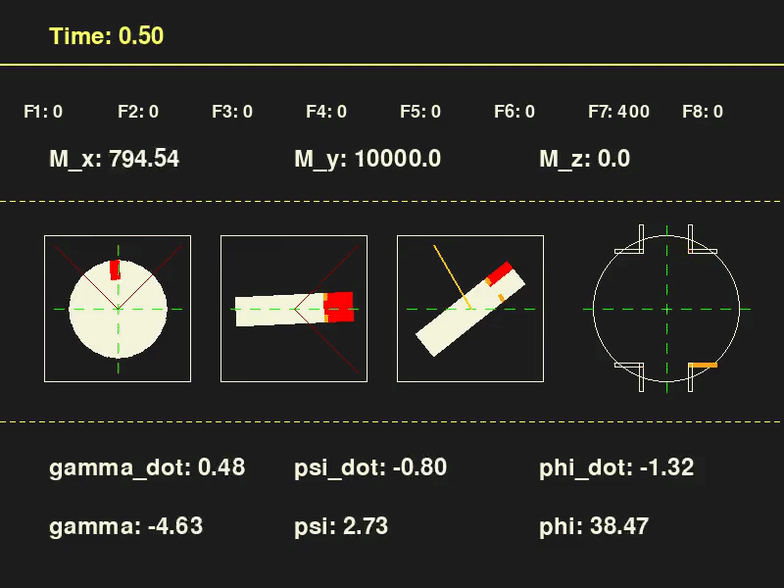

# Rocket Attitude Control / 火箭姿态控制

<p align="center">
  <a href="artifacts/demos/a2c_2460000_seed0_dynamic_plot.mp4"></a>
  <a href="artifacts/demos/a2c_2460000_seed0_rocket_ui.mp4"></a>
</p>
<p align="center"><sub>Dynamic telemetry / 动态遥测　·　Rocket attitude interface / 火箭姿态界面<br>Click either preview to open the full MP4 / 点击预览可打开完整 MP4</sub></p>

[](https://github.com/yusiwei77-star/rocket-attitude-control/actions/workflows/ci.yml)
[](LICENSE)

A reproducible rigid-body rocket attitude-control simulation with an eight-thruster action space and an A2C policy trained with Stable-Baselines3.

基于刚体姿态动力学、八路开关推力器和 Stable-Baselines3 A2C 的可复现火箭姿态控制项目。

## Results / 结果

The published checkpoint is [`models/a2c_2460000.zip`](models/a2c_2460000.zip). It was selected after evaluating all four local checkpoints under the same initial-condition distribution.

公开权重为 [`models/a2c_2460000.zip`](models/a2c_2460000.zip)，它是在相同初始状态分布下比较四个本地权重后选出的综合最优模型。

| Metric / 指标 | 20 seeded episodes / 20 个固定种子 |
|---|---:|
| 70 s constraint success / 70 秒约束成功率 | 100% |
| 130 s final success / 130 秒最终成功率 | 100% |
| Mean fuel impulse / 平均燃料冲量 | 23,838 N·s |
| Mean attitude RMSE / 平均姿态 RMSE | 0.606° |
| Mean angular-rate RMSE / 平均角速度 RMSE | 0.044°/s |

Synchronized seed-0 demonstrations (327 frames, 30 fps, 10.9 s each):

seed 0 同步演示（均为 327 帧、30 fps、10.9 秒）：

- [Dynamic telemetry plot / 动态遥测曲线](artifacts/demos/a2c_2460000_seed0_dynamic_plot.mp4)
- [Rocket attitude interface / 火箭姿态界面](artifacts/demos/a2c_2460000_seed0_rocket_ui.mp4)
- [Result summary / 结果摘要](artifacts/results/a2c_2460000_seed0_summary.json)
- [Compressed trajectory / 压缩轨迹](artifacts/results/a2c_2460000_seed0_trajectory.npz)

## Environment / 环境

- State / 状态: `angle_error[3]` and `angle_velocity_error[3]`, in radians and radians per second.
- Action / 动作: `MultiBinary(8)`; each active thruster produces 400 N.
- Simulation / 仿真: 0.1 s fixed step, exactly 1,300 steps, ending at 130.0 s.
- Target / 目标: follow a two-phase nominal trajectory and finish near `[0°, 0°, 120°]` while respecting angular-rate constraints and minimizing fuel.
- Rendering is optional and never initialized during headless training or evaluation.

状态由三轴姿态误差和角速度误差组成；动作是八个 0/1 推力器开关。仿真采用 0.1 秒固定步长，在 130.0 秒精确结束。奖励同时考虑标称轨迹跟踪、70/130 秒约束和燃料消耗。

## Installation / 安装

Python 3.9 or newer is required. A virtual environment is recommended.

需要 Python 3.9 或更高版本，建议使用虚拟环境。

```bash
python3 -m venv .venv
source .venv/bin/activate
python -m pip install --upgrade pip
python -m pip install -e ".[dev]"
```

The project uses headless OpenCV only for Stable-Baselines3 compatibility and uses `imageio-ffmpeg` for MP4 encoding. This avoids the SDL collision between GUI OpenCV and pygame on macOS.

项目仅使用 headless OpenCV 满足 Stable-Baselines3 导入，并用 `imageio-ffmpeg` 编码 MP4，从而避免 macOS 上 GUI OpenCV 与 pygame 的 SDL 冲突。

## Commands / 命令

### Evaluate / 评估

```bash
rocket-evaluate \
  --model models/a2c_2460000.zip \
  --episodes 20 \
  --start-seed 0 \
  --device cpu \
  --output artifacts/results/evaluation.json
```

### Render both synchronized videos / 生成两段同步视频

```bash
rocket-render \
  --model models/a2c_2460000.zip \
  --seed 0 \
  --frames 327 \
  --fps 30 \
  --output-dir artifacts/demos
```

The command runs the policy once, then feeds the same sampled trajectory frames to both video renderers. The two MP4 files therefore have identical timing.

该命令只运行一次策略，再把同一组轨迹帧交给两个视频渲染器，因此两段 MP4 的时间轴完全一致。

### Train / 训练

A short training run defaults to 100,000 steps:

默认短训练为 100,000 步：

```bash
rocket-train --output models/a2c_latest.zip
```

Use the following command for the published checkpoint's training horizon:

使用下列命令训练到公开权重对应的步数：

```bash
rocket-train \
  --timesteps 2460000 \
  --seed 0 \
  --checkpoint-freq 100000 \
  --output models/a2c_latest.zip
```

The CLI fixes the checkpoint-compatible A2C hyperparameters: `n_steps=5`, learning rate `0.0007`, `gamma=0.99`, `gae_lambda=1.0`, `vf_coef=0.5`, and `max_grad_norm=0.5`. Exact learned weights can still vary across hardware and library builds.

CLI 固定使用与权重兼容的 A2C 超参数；由于硬件和依赖构建差异，重新训练得到的具体参数仍可能不同。

## Project layout / 项目结构

```text
src/rocket_attitude_control/  # physics, Gymnasium environment, rendering, rollout
models/                       # selected A2C checkpoint
artifacts/                    # synchronized videos and seed-0 results
tests/                        # environment, checkpoint, regression, and video tests
```

Run all checks with:

```bash
SDL_VIDEODRIVER=dummy SDL_AUDIODRIVER=dummy MPLBACKEND=Agg pytest
```

## License / 许可

Released under the [MIT License](LICENSE). / 本项目采用 [MIT License](LICENSE)。
