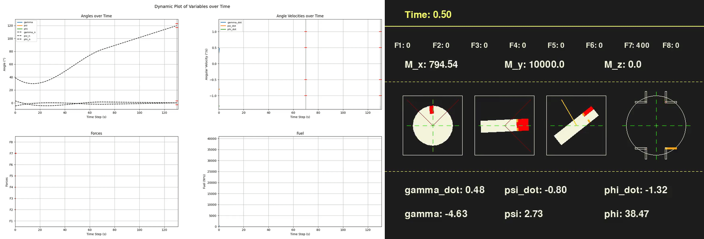

# 火箭姿态控制

**本项目训练一个强化学习控制器，通过八个开关式姿态推力器，使模拟火箭完成从 `[0°, 0°, 35°]` 附近到 `[0°, 0°, 120°]` 的三轴姿态机动，同时跟踪参考轨迹、满足角速度约束并减少推进剂消耗。**

<p align="center">
  
</p>
<p align="center"><a href="artifacts/demos/a2c_2460000_seed0_dynamic_plot.mp4">动态遥测 MP4</a>　·　<a href="artifacts/demos/a2c_2460000_seed0_rocket_ui.mp4">火箭姿态 MP4</a></p>

左侧展示实际与目标欧拉角（`gamma`、`psi`、`phi`）、角速度、推力器点火和累计推力冲量；右侧展示三个姿态投影及八个推力器的布局。一次 130 秒的仿真被压缩为 10.9 秒预览。

[](https://github.com/yusiwei77-star/rocket-attitude-control/actions/workflows/ci.yml)
[](LICENSE)

## 项目简介

在每个 0.1 秒仿真步，优势演员–评论家算法（Advantage Actor-Critic，A2C）决定八个 400 N 姿态推力器中哪些点火。策略只观察三轴姿态误差和角速度误差，不直接读取完整参考轨迹或未来状态。

| 项目 | 定义 |
|---|---|
| 被控对象 | 简化的三轴刚体转动动力学 |
| 初始状态 | 姿态约为 `[0°, 0°, 35°]`，并加入由随机种子确定的姿态和角速度扰动 |
| 观测 | 三轴姿态误差 `angle_error[3]`（rad）和角速度误差 `angle_velocity_error[3]`（rad/s） |
| 动作 | `MultiBinary(8)`；八位 0/1 动作，每位控制一个 400 N 推力器 |
| 仿真回合 | 1,300 个固定步，从 0 秒开始并精确结束于 130.0 秒 |
| 控制目标 | 跟踪标称机动、最终接近 `[0°, 0°, 120°]`、满足角速度限制并减少指令推力冲量 |

仓库包含 Gymnasium 环境、训练与评估命令、预训练权重、确定性回归测试，以及同步 MP4 和 GIF 生成工具。

## 已验证结果

仓库内置权重 [`models/a2c_2460000.zip`](models/a2c_2460000.zip)，并在随机种子 0–19 上进行了确定性评估：

- 70 秒时，三轴角速度绝对值必须低于 `[0.5°, 1.0°, 1.0°]/s`。
- 130 秒时，每个姿态角必须位于目标 `[0°, 0°, 120°]` 的 ±3° 范围内，并满足相同的角速度约束。
- 推力冲量是指令推力随时间的积分（`N·s`），在本项目中用作推进剂消耗的代理指标。

| 指标 | 随机种子 0–19 |
|---|---:|
| 70 秒角速度约束成功率 | 100% |
| 130 秒最终约束成功率 | 100% |
| 平均推力冲量 | 23,838 ± 11,295 N·s |
| 平均姿态 RMSE | 0.606° |
| 平均角速度 RMSE | 0.044°/s |

页面顶部的预览使用随机种子 0，它只是一个演示样本，不代表 20 个随机种子的平均结果。可使用 `rocket-evaluate` 复现汇总表。

- [随机种子 0 结果摘要](artifacts/results/a2c_2460000_seed0_summary.json)
- [随机种子 0 压缩轨迹](artifacts/results/a2c_2460000_seed0_trajectory.npz)
- [20 个随机种子的回归测试](tests/test_policy.py)

## 快速开始

需要 Python 3.9 或更高版本；持续集成当前验证 Python 3.11。首先克隆仓库：

```bash
git clone https://github.com/yusiwei77-star/rocket-attitude-control.git
cd rocket-attitude-control
```

### macOS 或 Linux

```bash
python3 -m venv .venv
source .venv/bin/activate
python -m pip install --upgrade pip
python -m pip install -e ".[dev]"
```

### Windows PowerShell

```powershell
py -3.11 -m venv .venv
.\.venv\Scripts\Activate.ps1
python -m pip install --upgrade pip
python -m pip install -e ".[dev]"
```

使用预训练控制器运行一次仿真，并重新生成两段 MP4 和合成 GIF：

```bash
rocket-render --model models/a2c_2460000.zip --seed 0 --device cpu
```

输出写入 `artifacts/demos/` 和 `artifacts/results/`。使用以下命令评估 20 个固定随机种子：

```bash
rocket-evaluate --model models/a2c_2460000.zip --episodes 20 --start-seed 0 --device cpu --output artifacts/results/evaluation.json
```

## 工作原理

1. `RocketSimulation` 将八个推力器开关转换为火箭本体力矩，并积分非线性欧拉角动力学。
2. `RocketEnv` 将仿真封装为 Gymnasium 字典观测和 `MultiBinary(8)` 动作空间。
3. 奖励函数综合考虑轨迹误差、收敛方向、70/130 秒约束及推力器使用惩罚。
4. Stable-Baselines3 使用 A2C 训练 `MultiInputPolicy`，评估时采用确定性动作。

## 训练

默认的短训练实验为 100,000 步：

```bash
rocket-train --seed 0 --device cpu --output models/a2c_latest.zip
```

使用 2,460,000 步可匹配公开权重的训练步数：

```bash
rocket-train --timesteps 2460000 --seed 0 --device cpu --checkpoint-freq 100000 --output models/a2c_latest.zip
```

CLI 固定使用与公开权重兼容的超参数：`n_steps=5`、学习率 `0.0007`、`gamma=0.99`、`gae_lambda=1.0`、`vf_coef=0.5`、`max_grad_norm=0.5`。由于硬件、依赖和浮点计算差异，重新训练得到的具体权重仍可能不同。

## 适用范围与限制

本项目是可复现的控制与强化学习实验，不是可直接用于飞行的制导、导航与控制软件。模型聚焦转动运动，未包含平动、重力、空气动力、质量变化、传感器噪声、执行器延迟、最小脉冲宽度和推力器故障；推力冲量只是优化代理量，并非推进剂质量模型。

自动化测试当前运行于 Ubuntu + Python 3.11。代码按跨平台方式实现并提供了 Windows 命令，但 Windows 尚未纳入持续集成。

## 测试

```bash
pytest
```

测试覆盖确定性重置与终止、观测和动作空间、权重加载、20 个随机种子的策略回归、MP4 元数据及同步 GIF 元数据。

## 项目结构

```text
src/rocket_attitude_control/
  simulation.py               # 刚体动力学、奖励和约束
  nominal.py                  # 标称姿态轨迹
  env.py                      # Gymnasium 环境适配器
  rendering.py                # pygame 姿态渲染器
  rollout.py                  # 评估和轨迹采集
  video.py                    # MP4 和同步 GIF 生成
  cli/                        # 训练、评估和渲染命令
models/                       # 公开的 A2C 权重
artifacts/                    # 演示视频和随机种子 0 结果
tests/                        # 环境、策略和媒体回归测试
```

## 许可证

本项目采用 [MIT License](LICENSE)。
